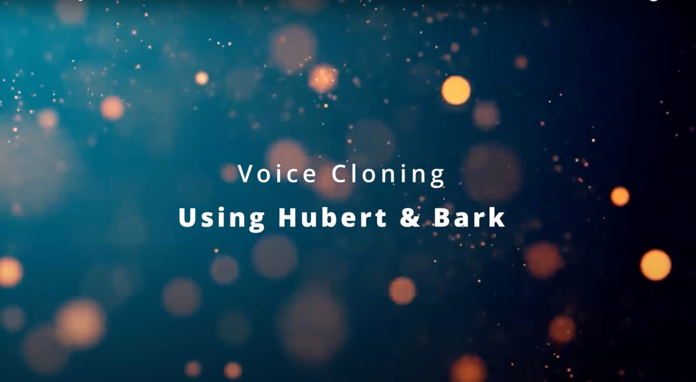

# Voice Cloning

## Project Description

This project involves creating a Gradio interface for voice cloning, leveraging the power of the HuBERT model and Bark for audio and text processing. The project's key components include:

*Data Preprocessing:* The script begins by setting up the necessary directory structure for storing audio and model data.

*HuBERT Model:* It loads and utilizes the HuBERT model for extracting semantic vectors from audio.

*EnCodec:* The code employs EnCodec to extract discrete codes from audio.

*Voice Prompt Generation:* Voice prompts are generated and saved for later use in voice cloning.

*Audio Generation:* The code then proceeds to generate audio based on the provided text, utilizing the semantic tokens and prompts generated earlier.

*Gradio Interface:* The entire project is wrapped within a Gradio interface that offers two main functionalities - voice cloning and audio generation. Users can upload an audio file to generate voice prompts and later create audio from text input.

*User Controls:* The Gradio interface allows users to control parameters like text semantic temperature, minimum EOS probability, and semantic-to-waveform generation temperature for audio generation.

## Project Setup

### 1. Clone the repository

```bash
git clone https://github.com/VitthalGupta/voice-cloning.git
```

### 2. Install dependencies & Run the script

```bash
sh run.sh
```
### 3. Tutorial

[](https://youtu.be/IbY7bvFo8QU)

## Project Organization

------------

    ├── LICENSE
    ├── Makefile           <- Makefile with commands like `make data` or `make train`
    ├── README.md          <- The top-level README for developers using this project.
    ├── data
    │   ├── external       <- Data from third party sources.
    │   ├── interim        <- Intermediate data that has been transformed.
    │   ├── processed      <- The final, canonical data sets for modeling.
    │   └── raw            <- The original, immutable data dump.
    │
    ├── docs               <- A default Sphinx project; see sphinx-doc.org for details
    │
    ├── models             <- Trained and serialized models, model predictions, or model summaries
    │
    ├── notebooks          <- Jupyter notebooks. Naming convention is a number (for ordering),
    │                         the creator's initials, and a short `-` delimited description, e.g.
    │                         `1.0-jqp-initial-data-exploration`.
    │
    ├── references         <- Data dictionaries, manuals, and all other explanatory materials.
    │
    ├── reports            <- Generated analysis as HTML, PDF, LaTeX, etc.
    │   └── figures        <- Generated graphics and figures to be used in reporting
    │
    ├── requirements.txt   <- The requirements file for reproducing the analysis environment, e.g.
    │                         generated with `pip freeze > requirements.txt`
    │
    ├── setup.py           <- makes project pip installable (pip install -e .) so src can be imported
    ├── src                <- Source code for use in this project.
    │   ├── __init__.py    <- Makes src a Python module
    │   │
    │   ├── data           <- Scripts to download or generate data
    │   │   └── make_dataset.py
    │   │
    │   ├── features       <- Scripts to turn raw data into features for modeling
    │   │   └── build_features.py
    │   │
    │   ├── models         <- Scripts to train models and then use trained models to make
    │   │   │                 predictions
    │   │   ├── predict_model.py
    │   │   └── train_model.py
    │   │
    │   └── visualization  <- Scripts to create exploratory and results oriented visualizations
    │       └── visualize.py
    │
    └── tox.ini            <- tox file with settings for running tox; see tox.readthedocs.io

--------

## Contributors

<a href="https://github.com/VitthalGupta/voice-cloning/graphs/contributors">
    
</a>

[END]